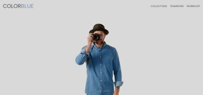
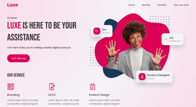
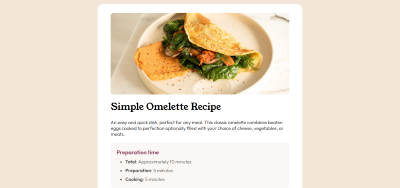
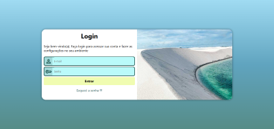
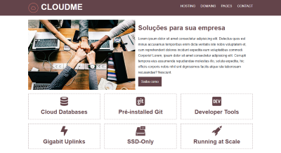

# Projetos de Estudo: HTML & CSS

Esse é meu repositório de projetos de estudo com **HTML** e **CSS**!  
Quero usar esse espaço para praticar e aprimorar meus conhecimentos no desenvolvimento de páginas web usando essas duas linguagens.

(Todos os projetos estão **responsivos** ou seja, se adaptam a diferentes tamanhos de tela)

## 📁 Como Visualizar

Clique nos prints para abrir meus projetos.

